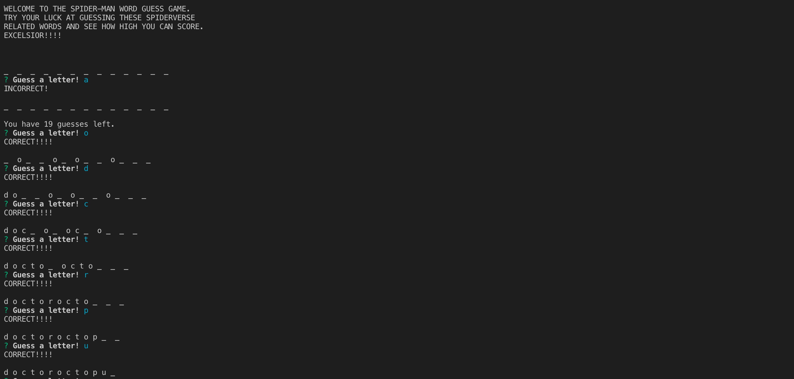
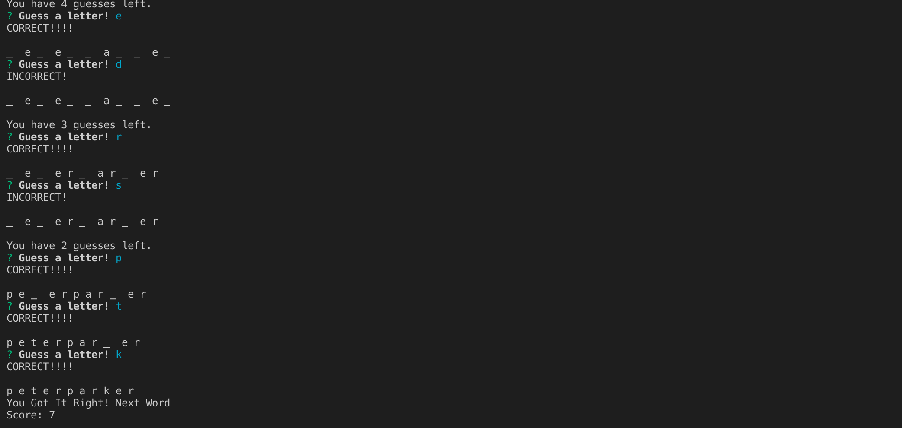
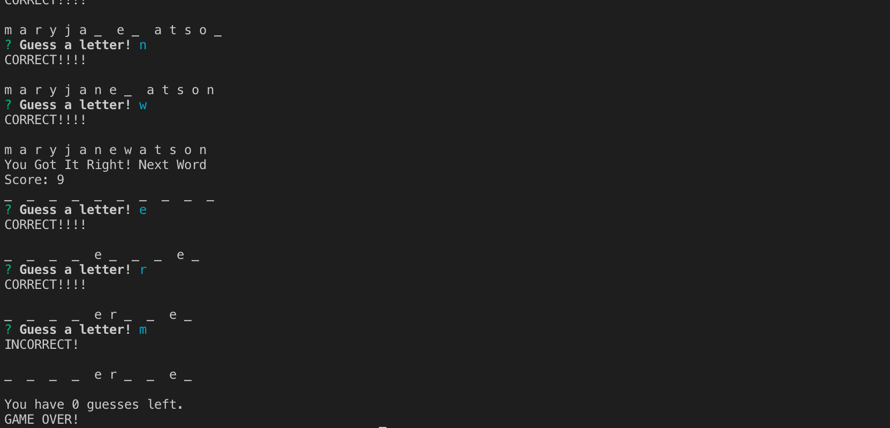

# Constructor-Word-Guess

## Overview
The Constructor Word Guess is a command line game that receives user input using the Inquirer NPM packages.

## Usage
The Constructor Word Guess runs in the Terminal window. User must install the Inquirer NPM package before being able to run the application. User must type "node index.js" to start the game. The game will start and user will be prompted to enter a letter guess to try and figure out what the word is. There is a score counter to keep track of how many Word puzzles that the user is able to solve before running out of guesses.

## Examples
### Images:

Screenshot of the start of the Constructor Word Guess game.

Screenshot of a solved word puzzle.

Screenshot of the end of the Constructor Word Guess game.

## Technologies
The Constructor Word Guess game was created using these technologies
* JavaScipt
* Node.js
* Inquirer NPM Package

## GITHUB
[github link](https://github.com/saronnhong/Constructor-Word-Guess)

## My Role
My role in the app development was to create the Constructor Word Guess game based on instructions from UCSD Extension Full Stack Bootcamp. 

## Why This Project Is Useful
This project is an exercise in using multiple constructors to call upon each other. The Letter constructor creates the blueprint for the letter and stores the value of the character, a boolean value to show if the character has been guessed, a function that checks if the character has been guessed, and a function that displays either the character or an empty space depending on if the character has been guessed. The Word constructor builds upon the letter constructor and builds an array of Letter objects. The Index.js constrols all of the logic in the game.  